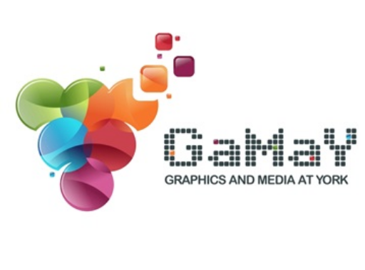

  

The **Graphics and Media at York (GaMaY) Hub** is the site of the conjoined research labs and research activities that span Human-Computer Interaction, Computer Graphics, Visual Computing and Immersive Technologies.
The GaMaY Hub is located in the Lassonde Research Centre (LRC), in the [Department of Electrical Engineering and Computer Science](https://lassonde.yorku.ca/eecs/) in the [Lassonde School of Engineering](https://lassonde.yorku.ca/) at [York University](https://www.yorku.ca/). Here's how to [Visit Us](Visit%20Us.md).
## Faculty members:
- [Melanie Baljko](https://lassonde.yorku.ca/users/mb)
- [Petros Faloutsos](https://lassonde.yorku.ca/users/pfal)
- [Matt Kyan](https://lassonde.yorku.ca/users/mkyan)
- [Sana Maqsood](https://lassonde.yorku.ca/users/smaqsood)
- [Kiemute Oyibo](https://lassonde.yorku.ca/users/koyibo/)
- [James Smith](https://lassonde.yorku.ca/users/drsmith/)
- [Vassilios Tzerpos](https://lassonde.yorku.ca/users/bil/)
## Research Labs:
- [Audio Processing Techniques Lab at York (APTLY)](https://bil.eecs.yorku.ca/aptly-lab/) 
- [Computer Graphics Lab @ GaMaY](https://lassonde.yorku.ca/users/pfal)
- [Engineering Education Sandbox](https://www.yorku.ca/professor/drsmith/)
- [Immersive Computing Lab @ GaMaY](https://lassonde.yorku.ca/users/mkyan)
- [**La**b for **S**ocially-aware **Soft**ware **E**ngineering (LaSSoftE)](https://bil.eecs.yorku.ca/lassofte/)
- [Practices in Enabling Technologies Lab (PiET)](https://piet.apps01.yorku.ca/)
- [Practical Privacy Lab @ GaMaY](https://lassonde.yorku.ca/users/smaqsood)
- [Persuasive Design Lab @ GaMaY](https://lassonde.yorku.ca/users/koyibo)
## Research Facilities:
The GaMaY Hub features a set of research facilities within the Lassonde Research Centre (LRC) that are used collectively by the labs and the hub researchers.
- Maker/Prototyping Space (LRC135)
- Dirty/Messy Workroom (connect to the Maker/Prototyping Space, for materials processing and fabrication) (LRC142)
- Usability Studies Lab (LRC128)
- Co-Design Space (LRC157)
- XR Design and Immersive Interaction Space (LRC139)
- Computer Graphics Laboratory (LRC139)
- Acoustic Data Acquisition (ADA) Suite (LRC130) 
- Graduate student office spaces (LRC122)
- conference rooms and research seminar rooms